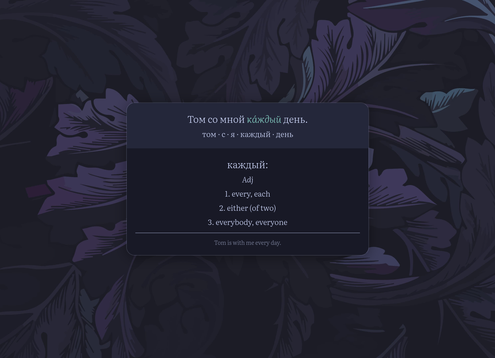
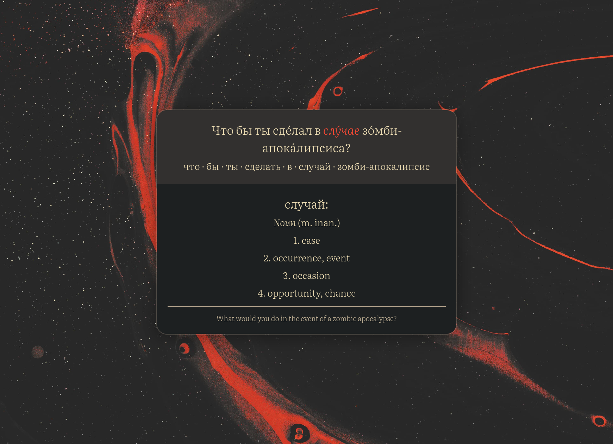
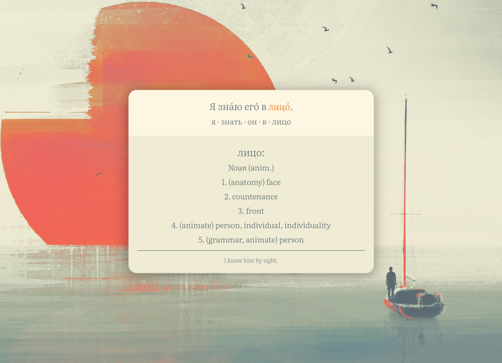
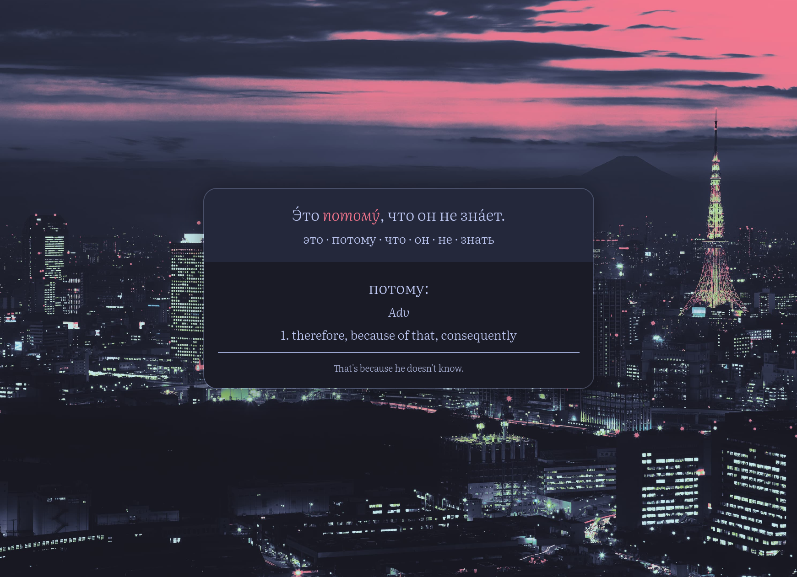
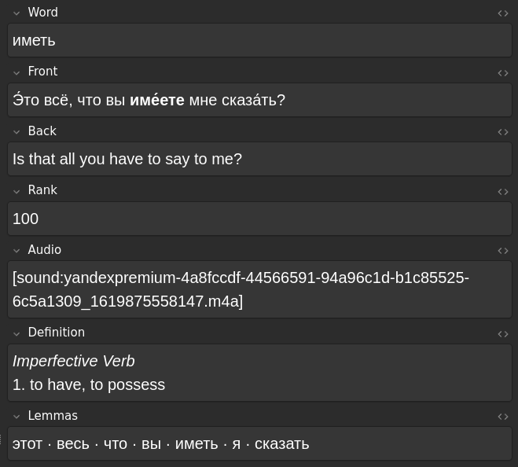

# Ankite

> A simple, nice-looking Anki template.

  
    
  
  

Base Anki has a very functional design, and when looking around for nice-looking
card templates, not many are great for stealing. Many are paid, and many are
complex enough that figuring out how to modify them to fit your workflow or
style is tricky. Ankite is a minimalist but nice-looking template, designed to
be transparently hackable. Admittedly, it's designed mostly with language
learning in mind, but at a glance there shouldn't be much in the way of using it
for other subjects.

Some features:
- I spent multiple hours figuring out how to center cards in Anki, so you don't
  have to (the magic is in finding the `.card > div` selector)
- All colors are variables, so swapping color schemes is easy
- Behaves consistently in both dark and light mode
- Looks fine on mobile
- Your study buddies will be jealous

## Installation

The core of the template is in [`template`](./template), there are two versions
for different sources. The same `style.css` applies for both.

- `ru15k` is compatible with the cards in
  [this collection of 15000 russian words](https://ankiweb.net/shared/info/563580199).
- `vocabsieve` is compatible with the cards generated by
  [Vocabsieve](https://github.com/FreeLanguageTools/vocabsieve).

If you just want to get hacking, I recommend copying the `ru15k` template as it
has more fields available, and modifying it to fit your own cards. Here are the
fields it's based on:

    

### Backgrounds

I use the [Custom Background](https://ankiweb.net/shared/info/1210908941)
add-on. To help reduce screen flickering where it reloads the background every
card, it helps to optimize images for progressive rendering. All the optimized
backgrounds I used for the screenshots are available in [`media`](./media), so
the flickering isn't noticeable on my machine. [Squoosh](https://squoosh.app/)
is a versatile tool for configurably optimizing images: enabling either
"interlacing" or "progressive rendering" on your compression format of choice
tends to kill any noticeable flickering.

For tweaking backgrounds to match a specific color scheme, I've had good success
using [Lutgen](https://github.com/ozwaldorf/lutgen-rs).

### Fonts

The font I use is [Literata](https://fonts.google.com/specimen/Literata), which
for convenience I've bundled in `media` along with the backgrounds. If you want
to use it, follow the [Anki Manual on Installing Fonts](https://docs.ankiweb.net/templates/styling.html#installing-fonts),
otherwise the cards will fallback to the system's default serif font.

## Contributing

Contributions are welcome! Some ideas for future work:

- Configurably using [faded glass](https://css.glass/) transparent cards instead of opaque ones
- Support for images
- An installer script

## Licensing

Everything under `screenshots` and `template` is original and licensed under the
MIT license, see [`LICENSE`](./LICENSE) for details. The files under `media` are
created by others and may be subject to their own licensing restrictions.
